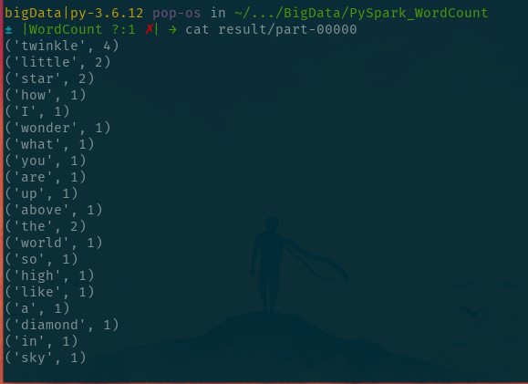

# PySpark_WordCount
Counting the number of words from a text file using pyspark

## To test this example try this steps (example on linux):
* open terminal
* ```pip install pyspark```
* ```git clone https://github.com/sayfchagtmi/PySpark_WordCount.git```
* ```cd PySpark_WordCount```
* ```git checkout WordCount```
* ```python src/run.py```
## To display results type
```cat output/part-00000```

## Obtained output

